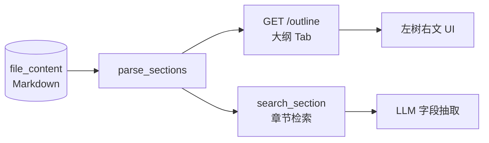
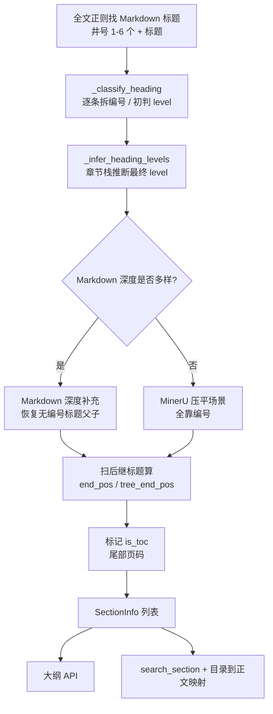

# 大纲功能与章节树计算深究

> 适用范围：`parse_sections()` / `_classify_heading()` / `_infer_heading_levels()` / `search_section()` / `GET /file/{file_id}/outline`
>
> 核心实现：[`service/extraction_service.py`](../service/extraction_service.py)（约 L1208–L1598）
>
> 相关文档：[章节树计算与检索](./SECTION_HIERARCHY.md)、[章节计算改动说明](./SECTION_CALCULATION_CHANGES.md)

---

## 1. 大纲功能是什么、解决什么问题

### 1.1 业务定位

本系统处理的是 PDF 解析后的 Markdown。MinerU（以及同类 OCR/版面工具）产出的 Markdown 有一个典型缺陷：**标题层级被压平**。抽检 `type_id=yigongdaizhen` 的 5 份样本，1,732 个标题全部写成单个 `#`，原生 `#`/`##`/`###` 几乎不可用。

与此同时，以工代赈、工程可研、政府报告这类文档的真实结构信息**几乎全在编号里**：

```text
第1章 概述
1.1 项目概况
1.1.1 项目名称
1.1.2 建设地点
1.2 编制依据
第2章 建设背景
```

因此大纲功能不是「读 Markdown 的 `#` 数量画树」，而是：

> **从压平的 Markdown 标题里，用编号体系 + 章节作用域 + 局部条目上下文，把真实父子关系恢复出来，再据此切出章节正文。**

### 1.2 两个消费方、同一套口径

| 消费方 | 入口 | 用途 |
|---|---|---|
| **文件详情「大纲」Tab** | `GET /file/{file_id}/outline` | 左侧章节树导航，右侧展示章节正文，供人工查阅 |
| **字段抽取 `search_type=section`** | `search_section()` | 按章节标题模式命中后，把**完整子树**喂给 LLM 做字段抽取 |

两者共用同一个 `parse_sections()`，且切片边界完全一致（大纲 `tree_content` ≡ 章节检索 `content`）。设计意图是：**前端看到什么 = 抽取时能匹配到什么**，避免「UI 有内容但抽取取不到」或反过来。



### 1.3 为什么不能只做「展示用大纲」

章节树直接决定抽取输入长度：

- 父节点若在第一个子标题处提前结束（历史 bug），章节检索可能只拿到标题 + 几十字引言 → LLM 抽不到值。
- 若把目录区、插图标题、尺寸标题（`2.5米高挡土墙`）误判成章节，则会截断正文或返回目录占位。

真实样本上的量级（修复后）：

| 样本 | 章节 | 原切片长度 | 现切片长度 |
|---|---|---:|---:|
| 邓州市张楼乡老君村 | 1.1 项目概况 | 12 | 1,613 |
| 邓州市张楼乡老君村 | 7.1 组织架构 | 12 | 1,657 |
| 林芝市察隅县古井村 | 1.1 项目概况 | 12 | 3,408 |
| 隆德县杨河村 | 4.3.4.1 新建排水渠 | 23 | 1,307 |

---

## 2. 数据模型

### 2.1 `SectionInfo`

```python
@dataclass
class SectionInfo:
    index: int          # 在标题序列中的序号（0-based）
    number: str         # 拆出的编号，如 "第1章" / "1.1.1" / "（一）"
    title: str          # 清洗后的标题正文
    level: int          # 最终层级（内部比较用，不要求从 1 连续）
    numbered: bool      # 是否被识别为有编号
    start_pos: int      # 标题在原始 Markdown 中的起始偏移
    end_pos: int        # 平铺边界：下一个任意标题（自身正文）
    tree_end_pos: int   # 层级边界：下一个 level ≤ 自己的标题（含子树）
    is_toc: bool        # 目录候选：有编号，且清洗时去掉了尾部页码
```

### 2.2 两种正文范围

| 字段 | 边界 | 含义 | 用途 |
|---|---|---|---|
| `end_pos` | 下一个**任意**标题起点 | 自身正文（不含子节） | 大纲 UI 点击后右侧展示 |
| `tree_end_pos` | 后续第一个 **level ≤ 自身 level** 的标题起点 | 含全部子节/局部条目的完整子树 | **章节检索切片**、UI 缩进祖先计算 |

示例（假设 `1.1` 的 level=3，`1.1.1`/`1.1.2` 更深，`1.2` 同级）：

```text
# 1.1 项目概况          start=0
正文A
# 1.1.1 项目名称        start=100
正文B
# 1.1.2 建设地点        start=200
正文C
# 1.2 编制依据          start=300

1.1:  end_pos=100, tree_end_pos=300
1.1.1: end_pos=200, tree_end_pos=300
```

大纲接口同时下发两者：

```python
"content":      content[s.start_pos:s.end_pos],        # 自身正文
"tree_content": content[s.start_pos:s.tree_end_pos],   # 含子树
```

章节检索使用 `tree_end_pos`；前端缩进也用 `tree_end_pos` 判断祖先是否仍打开。

---

## 3. 计算流水线（总览）

`parse_sections(content)` 一次调用完成全部计算，**不落库、不缓存**，每次请求基于库中 Markdown 现算。



分阶段职责：

| 阶段 | 函数 | 输入 | 输出 |
|---|---|---|---|
| 标题抽取 | 正则 `^(#{1,6})[ \t]+(.+?)[ \t]*$` | Markdown 全文 | 标题文本 + markdown_level + 位置 |
| 编号分类 | `_classify_heading` | 单条标题 | `(fallback_level, number, clean_title, numbered)` |
| 层级推断 | `_infer_heading_levels` | metas 序列 | 最终 level 序列 |
| Markdown 补充 | `parse_sections` 内联 | markdown_levels + 已有 levels | 修正后的 levels |
| 边界计算 | `parse_sections` 内联 | levels + 标题位置 | `end_pos` / `tree_end_pos` |
| 目录映射 | `_section_body_aliases` | sections | toc_index → 正文 section |

---

## 4. 规则一：标题编号分类 `_classify_heading`

### 4.1 预处理

1. `_strip_trailing_page_num(title)`：去掉尾部「空白/引导点 + 纯数字」
   - `第7章 群众务工组织 ..... 71` → `第7章 群众务工组织`
   - `二、项目的基本情况 1` → `二、项目的基本情况`
   - 去掉后若与原标题不同，后续会标 `is_toc=True`（目录候选）

2. **尺寸标题白名单排除**：形如「数字 + 已列举单位」的开头，强制判为无编号叶子，避免工程图名截断章节：

```python
re.match(r"^\d+(?:[.．]\d+)?(?:毫米|厘米|公里|米|公顷|亩|吨|万元|元|[%％])", t)
# 例：2.5米高毛石挡土墙做法 → 不是编号 2.5
```

覆盖单位有限（毫米/厘米/公里/米/公顷/亩/吨/万元/元/%），不是通用尺寸语义识别。

### 4.2 编号规则表 `_HEADING_RULES`（顺序敏感）

| 顺序 | 初始 level | 正则意图 | 示例 |
|---:|---:|---|---|
| 1 | 1 | 第X章/卷/篇/部（中阿数字、可空格） | `第一章`、`第1章`、`第 2 卷` |
| 2 | 1 | 中文数字顿号 | `一、`、`二.` |
| 3 | 2 | 括号中文数字 | `（一）`、`(二)` |
| 4 | 2 | 第X节/条 | `第一节`、`第3条` |
| 5 | 4 | 括号阿拉伯数字 | `(1)`、`（1）` |
| 6 | 5 | 右括号阿拉伯数字 | `1）`、`2)` |
| 7 | 3→动态 | **点分十进制**（必须在单数字之前） | `7.1`、`8.1.2`、`1.1.1.1` |
| 8 | 3 | 单数字 + 顿号/点 | `1.`、`2、`、`3．` |
| 9 | 3 | 纯数字 + 空格 | `1 概述` |

**点分十进制的动态 level**：

```python
# 初始匹配 level==3 且编号形如 a.b(.c...) 时：
level = 数字段数 + 1
# 1.1 → 3；1.1.1 → 4；1.1.1.1 → 5
```

同时把编号后多余句点从标题里剥掉：`7.1. 组织架构` → number=`7.1`，title=`组织架构`。

### 4.3 返回值

```python
# 命中
return level, number, clean_or_original, True
# 未命中
return _PLAIN_LEVEL(=90), "", t, False
```

`_PLAIN_LEVEL=90` 是约定俗成的「叶子哨兵」，不是真实第 90 层。作用：

- 无编号标题恒大于任何编号 level
- 在压平文档里**不会**因为出现插图/说明标题而关闭前面的编号章节

### 4.4 关键点：这只是「初步分类」

`_classify_heading` 给出的 level 只是 fallback。同一表面形式在不同上下文里角色不同：

| 表面形式 | 可能角色 |
|---|---|
| `一、` | 全文中文纲目根，或数字小节内部的局部枚举 |
| `1.` | 数字根章，或章内局部条目 |
| `(1)` | 深层局部条目，或某层正文列表 |

**真正的父子关系必须靠 `_infer_heading_levels` 的章节栈。**

---

## 5. 规则二：章节栈推断 `_infer_heading_levels`

这是整个算法的核心。维护一个栈，元素为：

```text
(体系 kind, 体系内深度 rank, 实际层级 level)
```

并预计算每条有编号标题的「下一个有编号标题编号」`next_numbers`（用于识别数字根章）。

### 5.1 四种编号体系

| kind | 典型形式 | 作用 |
|---|---|---|
| **structural** | 第X章/节/条/篇/卷/部 | 建立中文结构作用域；`部=0, 篇=0, 卷=0, 章=1, 节=2, 条=3` |
| **outline** | 一、 / （一） 等中文纲目（fallback 1 或 2） | 识别中文上层纲目及其同级关系 |
| **decimal** | `1`、`1.1`、`1.1.1` 数字根章与点分编号 | 按数字深度建立章节树 |
| **local** | 章内 `1.`、`(1)`、`1）` 等 | 相对**当前章节**计算条目深度 |

### 5.2 分支逻辑（按标题出现顺序）

#### A. 无编号标题

直接 `_PLAIN_LEVEL`，不入栈。

#### B. structural：结构章节

```text
rank = {部:0, 篇:0, 卷:0, 章:1, 节:2, 条:3}[单位]
弹栈直到栈顶是 structural 且 rank 更小
level = max(fallback, 父.level+1 或 1)
清空 numeric_root（进入中文结构后，数字根章体系失效）
```

效果：

```text
第一章 总则          structural rank=1, level=1
  一、范围            outline rank=1 → 挂在章下 level=2
    （一）子项        outline rank=2 → level=3
  二、对象            outline rank=1 → 关闭「一、」，仍在章下
第二章 规定          structural rank=1 → 关闭「第一章」
```

#### C. outline：中文纲目（fallback ∈ {1,2}）

进入条件（须同时满足其一）：

- 栈上尚无 decimal 体系；或
- 栈上已有同 fallback 的 outline

```text
numeric_root = None
弹栈直到栈顶是 structural，或 (outline 且 rank 更小)
level = max(fallback, 父.level+1 或 fallback)
```

用于：中文根章与数字小节混排时，仍能识别后续中文同级章。

```text
一、概况     outline level=1
1.1 位置     decimal（见 D）
二、预算     outline level=1（关闭「一、」）
2.1 费用     decimal
```

#### D. decimal：数字章节 / 数字根章

**根章识别**（纯数字或数字+点）：

```text
若 number 匹配 \d+[.．]?
  marker = 去掉数字后的符号（"." 或 ""）
  root 条件 1：下一个有编号标题是 "N.x" 形式（前缀相同且是点分）
  root 条件 2：numeric_root 已建立、marker 一致、且当前数字 > 根章数字
              （保证无子节的同级根章也能关闭前一章）
  命中则 numeric_root = (marker, N)
```

示例：

```text
1 概况          → 下一个是 1.1，识别为数字根章
  1.1 位置
    1.1.1 坐标
2 结论          → 根章体系延续，关闭「1 概况」（即便自己无子节）
3 预算
  3.1 明细
```

中间夹无编号标题仍可识别：

```text
1 概况
位置示意图      # 无编号，不打断
1.1 位置        # 仍把「1」当根
2 结论
```

**层级计算**：

```text
rank = 数字段数
弹栈：local 全清；decimal 且 rank ≥ 当前的弹出
若有 rank==1 的 decimal 根：level = 根.level + rank - 1
否则：level = max(3, 最近 structural/outline.level + 1) + max(0, rank-2)
```

即：点分深度是**相对**的，会挂到当前中文结构或数字根之下，而不是写死绝对层。

#### E. local：局部条目

```text
rank = fallback（如 1.→3，(1)→4）
弹栈：local 且 rank ≥ 当前的弹出
若有非 local 作用域：level = 父.level + 1（相对当前章节）
若栈空（无作用域）：level = max(fallback, 父.level+1)
```

关键修复：深层数字章节里的局部列表不再用固定小 level 去关闭父节。

```text
4.3.4.1 新建排水渠
  1. 材料        # local → 比 4.3.4.1 深
    (1) 规格
4.3.4.2 暗排水渠 # decimal 同级 → 关闭 4.3.4.1，同时清空 local 作用域
4.4 挡土墙
```

同一 local 序列内，后继同级条目关闭前者；进入下一 decimal 节时，local 作用域重置。

### 5.3 已知歧义

相同数字格式被多层复用时，算法无法唯一定性：

```text
1. 概况        # 可能是根章
1.1 位置
1. 局部甲      # 也可能是局部条目
2. 局部乙
2. 预算        # 新根章？还是局部「2.」？
```

当前启发式会尽量用 `numeric_root` 与 local 序列判断，但覆盖不全。

---

## 6. 规则三：Markdown 深度补充

仅当全文 `#` 深度不唯一时触发（`len(set(markdown_levels)) > 1`）。

```text
维护 markdown 栈：(markdown_level, 计算后 level)

无编号标题：
  level = (最近有编号标题的 level 或 last_numbered_level) + 1
  —— 用于压平文档里插图标题的归属

有编号标题：
  若存在 Markdown 父节点：
    level = max(编号推断 level, 父.level + 1)   # 保证显式父子
```

### 6.1 纯 Markdown 层级场景

```markdown
# 建设方案
## 道路
### 路面
## 供水
# 投资
```

得到 `1,2,3,2,1`，子树正确包含。

### 6.2 混合场景

```markdown
# 第一章 概况
# 1.1 位置
## 插图
# 第二章 预算
```

编号推断优先；`## 插图` 挂在 `1.1` 之下，不把「第二章」错误卷入。

### 6.3 设计取舍

- **不能**把所有 `#` 都当一级章：MinerU 样本全部是单 `#`。
- **不能**全局改成 Markdown 优先：会破坏压平文档的编号树。
- 因此只做「有父则加深、无父则回退」的保守补充。

### 6.4 已知反例（未修）

```markdown
# 概况
## 1.1 位置
# 预算
## 费用
```

「预算」没有 Markdown 父，回退到最近编号标题层级，可能被错误卷进「位置」之下。修复时需同时保住插图标题归属，不能简单改优先级。

---

## 7. 规则四：边界与目录

### 7.1 平铺边界 vs 子树边界

```python
flat_end = matches[i+1].start() if i+1 < n else len(content)
tree_end = len(content)
for j in range(i+1, n):
    if levels[j] <= level:
        tree_end = matches[j].start()
        break
```

`tree_end` 用的是**最终 level**（编号推断 + Markdown 补充），不是 `_classify_heading` 的初步值。这是修复「父节在子标题前结束」的关键。

### 7.2 目录候选 `is_toc`

```python
is_toc = numbered and _strip_trailing_page_num(raw_title) != raw_title
```

即：有编号 + 标题里去掉了尾部页码形式内容 → 目录候选。

**不删除目录节点**，只是打标。节点位置不变，仍出现在大纲列表里。

### 7.3 目录 → 正文映射 `_section_body_aliases`

```python
key = (规范化编号, 规范化标题)
# 编号：去空白、．→.、去尾点
# 标题：去空白

# 对 is_toc 节点：在非 toc 的同 key 节点里找最近正文
# 合订文件可能多次出现相同编号 → 优先该目录之后、距离最近的正文
```

章节检索（含 LLM 命中目录时）都会先做该映射：

```text
LLM 选中「第9章 劳务报酬发放 ..... 76」（目录）
→ 映射到「第9章 劳务报酬发放」（正文，含 9.1/9.2）
→ 切 tree_end_pos 子树
```

### 7.4 去重策略

```python
# 按 section_index 去重，不是按标题
deduped[r["section_index"]] = r
```

**不同编号/不同位置的同名正文都保留**（例如第 1 章和第 2 章都有「保障措施」）。旧逻辑按标题取最长会误删。

### 7.5 目录映射的边界

| 情况 | 行为 |
|---|---|
| 有页码目录 + 同编号同标题正文 | 映射到正文 |
| 无页码目录 | **不会**被标 `is_toc`，检索可能命中目录 |
| 正文标题以年份结尾（`1 计划 2026`） | 会被当目录候选并截成「计划」，有误伤风险 |
| 找不到同 key 正文 | 不猜测删除，保留原节点 |

---

## 8. 规则五：章节检索 `search_section`

### 8.1 配置项

| 字段 | 默认 | 说明 |
|---|---|---|
| `section_pattern` | `""` | 章节标题模式（查询词） |
| `section_match_type` / `match_type` | `contains` | `exact` / `fuzzy` / `contains` / `llm` |
| `threshold` | `0.8` | fuzzy 的 SequenceMatcher 阈值 |
| `max_results` | `3` | 最多返回几章 |
| `sort_order` | `asc` | 按章节索引排序 |
| `section_match_prompt` | 内置模板 | LLM 匹配自定义模板，必须含 `{section_list}` |

### 8.2 匹配路径

**非 LLM**（exact / fuzzy / contains）：遍历 sections，对 `title` 做字符串匹配。

**LLM**：把全部章节编号+标题列成清单，一次性让模型返回序号：

```text
1. 第9章 劳务报酬发放
2. 第10章 技能培训
3. 第9章 劳务报酬发放
...
```

响应里解析出的整数序号（1-based）映射回 sections。失败时记 warning 并 `mark_retry_failure()`，不抛给主流程。

### 8.3 切片与出口

```python
section = body_aliases.get(section.index, section)   # 目录→正文
content = content[section.start_pos:section.tree_end_pos]  # 含子树
results.append({
    "section_number", "section_title", "section_index", "level",
    "content",          # = tree_content
    "start_pos", "end_pos": tree_end_pos,
    "keyword": section_pattern,  # 占位符标签（pattern 可能 ≠ 命中标题）
})
# 按 index 去重 → 排序 → 截断 max_results
```

`keyword` 固定写 `section_pattern`，与前端插入的 `<search_result>` 占位符标签对齐；空 pattern 时下游会回退到 `section_title`。

### 8.4 在抽取链路中的位置

字段配置 `source_type=text` + `search_type=section` 时：

```text
取 file_content
  → search_section(content, search_config)
  → 命中章节树正文
  → 注入 prompt 的 <search_result>section_pattern</search_result>
  → chat_completion 抽取
```

调用点：`service/extraction_service.py`（正式抽取）、`blue_print/extraction_router.py`（提取测试）。

---

## 9. 前端大纲 Tab 如何渲染

### 9.1 数据获取

`ui/js/api.js` → `GET /file/{fileId}/outline`

### 9.2 缩进深度：用子树边界反推，不用 level

```javascript
const ancestorEnds = [];
data.forEach((item, idx) => {
    while (ancestorEnds.length && item.start_pos >= ancestorEnds[ancestorEnds.length - 1]) {
        ancestorEnds.pop();
    }
    const depth = ancestorEnds.length;
    ancestorEnds.push(item.tree_end_pos);
    // padding-left = 8 + depth * 16
});
```

含义：祖先节点的 `tree_end_pos` 若已越过当前节点 `start_pos`，说明祖先已结束。深度 = 仍打开的祖先数量。

好处：

- 不对 level 做四级封顶（旧逻辑会截断）
- 无编号子节（level=90）只要 `tree_end_pos` 包含关系正确，缩进就正确
- 与后端子树边界严格一致（有 UI 测试锁定）

### 9.3 交互

- 左侧章节列表点击 → 右侧展示该节 `content`（**自身正文**，不是 tree_content）
- 默认选中第 0 项
- 与表格 Tab 共用左右分栏 + 拖拽条布局

注意：UI 点击看自身正文，章节检索取完整子树——这是有意区分。

---

## 10. 端到端示例

### 10.1 混合编号 + 局部条目 + 目录

原文（示意）：

```text
# 第7章 群众务工组织 ..... 71
# 7.1. 组织架构
# 1. 领导小组
# (1) 职责
# 7.2 工作任务
# 第7章 群众务工组织
# 7.1 组织架构
# 1. 领导小组
# (1) 职责
# 7.2 工作任务
```

计算结果要点：

| 节点 | number | is_toc | level 关系 | tree_end |
|---|---|---|---|---|
| 目录「第7章 …71」 | 第7章 | 是 | 根 | （到下一同级） |
| 正文「第7章 …」 | 第7章 | 否 | 根 | 含 7.1/7.2 |
| 「7.1 组织架构」 | 7.1 | 否 | 更深 | 到 7.2 |
| 「1. 领导小组」 | 1. | 否 | local，比 7.1 深 | 到 7.2 |
| 「(1) 职责」 | (1) | 否 | local 子 | 到 7.2 |

若 `section_pattern=组织架构` 命中正文 7.1，则切片包含「1. 领导小组」「(1) 职责」，在「7.2 工作任务」前结束。

若 LLM 误选目录节点，`_section_body_aliases` 会映射到正文 7.1。

### 10.2 根章无子节仍关闭前章

```text
1 概况 → 1.1 位置 → 2 结论 → 3 预算 → 3.1 明细
```

`1`/`2`/`3` 同级；`1` 的 `tree_end_pos` 停在 `2`；`2` 的停在 `3`。

---

## 11. 已知边界与未修问题

摘自实现与既有评估，**不要默认都已解决**：

| # | 问题 | 影响 | 现状 |
|---|---|---|---|
| 1 | 只比数字段数，不校验编号前缀 | `1.1` 后接 `1.2.1` 会被算进 `1.1`；原文漏写 `1.2` 时归属错 | 有意不严格切——真实样本存在编号跳号但内容仍属当前章 |
| 2 | Markdown 同级标题可能被错误包含 | `# 概况` / `## 1.1` / `# 预算` 时「预算」可能落入「位置」 | 已复现，未修 |
| 3 | 同一数字格式多层复用 | `1.` 既是根章又是局部时可能判错 | 有启发式，不完整 |
| 4 | 无页码目录不标 `is_toc` | 检索可能返回目录短文本 | 多样本已复现 |
| 5 | 年份后缀被当页码 | `1 计划 2026` → 「计划」+ 目录候选 | 既有清洗行为，可能误伤 |
| 6 | 代码围栏内标题参与计算 | 围栏中的 `# 示例` 会截断前一章节 | 用例已复现；5 份真实样本未见围栏 |
| 7 | 尺寸排除仅有限单位 | `2.5吨` 在名单内，其他单位可能漏 | 刻意有限 |
| 8 | 章节树每次现算 | 大纲/检索无缓存；Markdown 改后立即生效，但已存提取结果不自动变 | 设计如此 |

---

## 12. 生效方式与运维注意

1. **章节树不落库**。改算法只需重载服务，**不需要重跑 MinerU**。
2. **已存储的提取/分析结果不会自动更新**。要用新章节树重抽，需对该文件重新执行抽取/分析。
3. 大纲接口与 `search_section` 共用 `parse_sections`，修一处两边同时生效。
4. 文件无内容或不存在 → 大纲返回 `[]`（非 404），与 `/tables`、`/chunks` 一致。

---

## 13. 测试覆盖

### 13.1 后端

| 文件 | 覆盖点 |
|---|---|
| `tests/test_section_hierarchy.py` | 混合编号、局部条目重置、中阿拉伯章、中文根章+数字子节、数字根章（含无子节同级、中间夹无编号）、尺寸标题、Markdown 混合、目录 leaders、LLM 选目录→正文、同名正文保留、大纲 API 与检索边界一致 |
| `tests/test_extraction_service.py` | `_classify_heading` 各编号格式、`parse_sections` 基础/子树/decimal 深度、`search_section` 切片/关键字标签/目录去重 |

关键断言示例：

```python
# 大纲 tree_content 与章节检索 content 完全一致
assert outline[1]["tree_content"] == result["content"]
assert outline[1]["tree_end_pos"] == result["end_pos"] == outline[4]["start_pos"]
```

### 13.2 前端

`tests/ui/outline.test.cjs`：用固定 `tree_end_pos` 数据驱动，断言 padding 为
`8, 24, 40, 56, 72, 24, 8`，锁定「深层与无编号子节缩进跟随后端子树边界」。

---

## 14. 设计原则小结

1. **编号优先，Markdown 保守补充**——压平文档的真实结构在编号里。
2. **初步分类 ≠ 最终层级**——必须经章节栈结合上下文。
3. **体系隔离**——structural / outline / decimal / local 各自维护 rank，局部条目相对当前章节。
4. **双边界**——自身正文与含子树正文分开；检索用后者，UI 点击用前者。
5. **目录打标不删除**——映射到同编号同标题正文，映射失败则保留原节点。
6. **去重按节点，不按标题**——保全不同章的同名正文。
7. **前后端同一算法**——大纲所见即抽取所得，避免口径漂移。
8. **现算不落库**——算法修复立即惠及所有已解析文件，无需重跑解析。

---

## 15. 关键代码索引

| 内容 | 位置 |
|---|---|
| 章节解析与检索 | `service/extraction_service.py:1208-1598` |
| `_PLAIN_LEVEL` / `_HEADING_RULES` | `:1210-1231` |
| `_classify_heading` | `:1234-1256` |
| `SectionInfo` | `:1259-1270` |
| `_infer_heading_levels` | `:1273-1346` |
| `parse_sections` | `:1349-1411` |
| `_section_body_aliases` | `:1414-1433` |
| `search_section` | `:1497-1598` |
| 大纲 API | `blue_print/file_router.py:946-980` |
| 抽取测试中的 section 分支 | `blue_print/extraction_router.py:538-539` |
| 前端大纲 Tab | `ui/js/app.js:881-917`（渲染）、`:1065-1083`（点击） |
| 前端缩进测试 | `tests/ui/outline.test.cjs` |
| 章节树回归 | `tests/test_section_hierarchy.py` |
